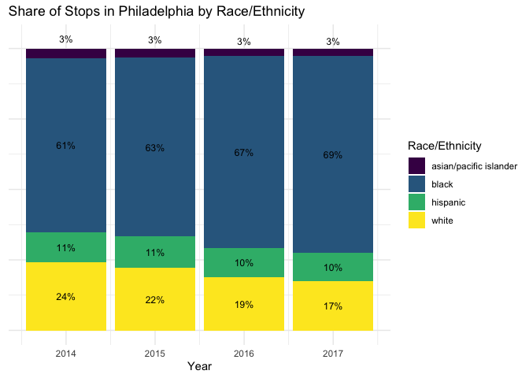
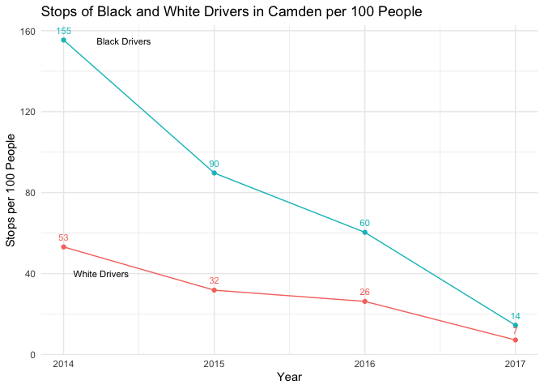

# README

<link href="README_files/libs/leaflet-1.3.1/leaflet.css" rel="stylesheet" />

<link href="README_files/libs/leafletfix-1.0.0/leafletfix.css" rel="stylesheet" />

<link href="README_files/libs/rstudio_leaflet-1.3.1/rstudio_leaflet.css" rel="stylesheet" />

# Executive Summary

**Dataset**

This project utilizes data collected by the Stanford Open Policing
Project. The Open Policing Project is a national repository of police
vehicle and pedestrian stops and searches. This project specifically
examines traffic stops in Camden, New Jersey and Philadelphia,
Pennsylvania. The data was pulled from each city’s respective police
department and cleaned by staff members at the Open Policing Project.
The cleaned data file includes 195,100 traffic stops performed by Camden
Police Department between April 2013 and January 2020, and 1,865,096
traffic stops performed by Philadelphia Police Department between
December 2013 to April 2018. Each observation in this dataset represents
a single traffic stop. Both datasets include information on the outcome
of the stop, latitude and longitudinal data on where the stop occurred,
and demographic data on the person stopped.

We wrangled the data to match the following criteria:

- Filtered to include just vehicular stops and to exclude pedestrian
  stops

- Filtered to include dates that overlapped across both jurisdictions,
  this includes the time frame of January 1, 2014 - December 31, 2017

- Recoded the raw age variables to match Census age groups

- Limited the data to include only stops that occurred within the
  geographic bounds of Camden and Philadelphia

\*\* Codebook\*\*

    Data report generation is finished. Please wait while your output file is being rendered.

**Research Question**

How do police traffic stops and outcomes vary by demographic groups
(i.e. race/ethnicity, age, gender) in two geographically adjacent
cities?

Our goal is to help both policymakers and citizens understand what
policing looks like in their communities. Accountability in policing is
crucial, and information empowers us to act when we can see how
inequities manifest, especially between different racial identities.

**Methodology**

*Dashboard with Maps*

The first step of our analysis was to create an interactive dashboard to
visualize traffic stops in both jurisdictions across demographic groups.
We used a Quarto shiny file to render a dashboard with a general
interactive sidebar that can be used to select a time frame in years and
location of stops to view. The dashboard also includes the following
tabs to allow for visualization of characteristics of individual stops:

- <u>Outcomes of Stops:</u> arrests, citation, no outcome (i.e., person
  was let off), warning

  - Note: Philadelphia data only contains outcome information on arrests
    and no outcome from the stop

- <u>Race of Driver Stopped:</u> Asian/Pacific Islander, Black,
  Hispanic, White

  - Note: We exclude other or unknown from this tab for ease of
    visualization

- <u>Gender of Driver Stopped:</u> Female or Male

  - Note: We recognize that gender is not a binary, however, this is how
    the data was captured and reported on

- <u>Age of Driver:</u> This dashboard includes buckets of age groups
  aligned with census outcomes

*Static Visuals of Differences in Stops by Race/Ethnicity*

In addition to developing a dashboard, we also created several
visualizations to dive deeper into potential differences between racial
and ethnic groups in both locations. To do this we created the following
static plots:

- <u>Stacked bar charts:</u> These stacked bar charts show the
  proportion of stops by race per year across both locations

- <u>Line charts:</u> These line charts show the change in stops per 100
  population for black and white drivers over time. This was calculated
  by dividing the number of stops per race by their overall population
  in that jurisdiction and multiplying it by 100.

<!-- -->

    Warning: The `<scale>` argument of `guides()` cannot be `FALSE`. Use "none" instead as
    of ggplot2 3.3.4.

*Interactive Maps Using Uber’s H3 Package*

We used Uber’s hexagon package to visualize aggregate stops. This
package was used to create chloropleth maps of the following
cross-tabulations over the full time period:

- Black stops in Philadelphia

- White stops in Philadelphia

- Black stops in Camden

- White stops in Camden

Below is a map of Black stops in Philadelphia

**Findings**

Despite Camden’s police department reform aimed at community-focused
policing, we still found racial disparities in who they stopped relative
to the population of different racial groups: Black people make up about
43% of the population but around 47% of stops. The disparities between
Black and White people stopped reduced over time. However, the Camden
results are skewed by a data reporting error in which Camden police
record Hispanic people as White, non-Hispanic, inflating the number of
White people reported in the data. Philadelphia showed more significant
racial disparities in who was stopped compared to Camden: Black people
make up about 41% of the population but 60-70% of stops, while White
people make up about 36% of the population but less than a quarter of
stops. The disparity between Black and White people stopped grew over
time.

The dashboard and hexagon maps are interactive and show concentration of
traffic stops both overall and by different outcomes and demographic
characteristics, but they are descriptive. While no analytical
conclusions can be drawn from the maps alone, further analysis of
neighborhood demographic characteristics and community relationships
with policing would help in contextualizing stop data. With a better
understanding of how traffic stops differ by neighborhood, policymakers
can investigate how policing might be improved to reduce disparities.
